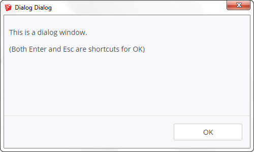
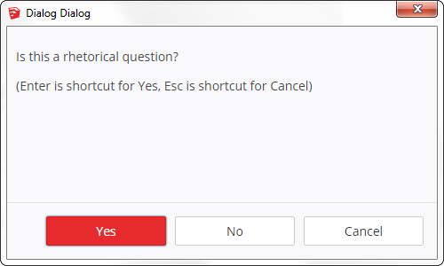

# Dialogs

 

Dialogs is a lightweight, easy to use UX library for SketchUp HtmlDialog
dialogs. It is designed purely using web technologies, no Ruby, to allow you to
easily implement it existing dialogs. You don't need to use some custom Ruby
dialog object, or rethink your back end code! Working directly in web
technologies, rather than through a Ruby wrapper, also allows for more versatile
dialogs, as you are not limited by the capabilities of the wrapper.
Dialogs can be thought of as a utility library, rather than a framework.

Dialogs consists of 3 separate modules that can be used either together or on their own.
If you like the visual appearance but think my Javascript skills are rubbish,
you can use only the style module. If you like the javascript behavior, but want
styling according to your own brand, you can leave out the styling module.

## Controls

The controls module helps with the feel of the dialog by adding some typical
dialog functionality, and automates simple callbacks:
- Automatically add callback actions to controls based on their class
- Assign shortcut keys to some standard controls
- Implement access keys to controls

For some sort of documentation, see the [somewhat complete example](examples/controls.html).

## Commit Button Order

The commit button order module helps ordering commit buttons consistent to the OS.

For some sort of documentation, see the [somewhat complete example](examples/commit-order.html).

## Style

The style module helps making the dialog appearance match that of SketchUp.

For some sort of documentation, see the [somewhat complete example](examples/style.html).

## General Examples

These examples shows all modules being used at once.

To run these examples, download the source code and select the modules directory
when asked for it.

````ruby
# Simple message box.
base_dir = UI.select_directory(title: "Locate modules/")
html = <<-HTML
  <!DOCTYPE HTML>
  <html>
    <head>
      <meta charset="UTF-8">
      <base href="#{base_dir}/" />
      <script src="jquery-1.12.4.js"></script>
      <script src="controls.js"></script>
      <link rel="stylesheet" type="text/css" href="commit-order.css">
      <script src="commit-order.js"></script>
      <link rel="stylesheet" type="text/css" href="style.css">
      <script>
        // Initialize the controls when the document is ready.
        $(document).ready(function() {
          dlgInitControls();
          dlgSetCommitOrder();
        } );
      </script>
    </head>
    <body>
      <div class="dlg-content-area">
        <p>
          This is a dialog window.
        </p>
        <p>(Both Enter and Esc are shortcuts for OK)</p>
      </div>
      <div class="dlg-commit-buttons">
        <button class="dlg-default-action dlg-callback-ok>OK</button>
      </div>
    </body>
  </html>
HTML
dialog = UI::HtmlDialog.new(
  dialog_title: "Dialog Dialog",
  width: 500,
  height: 300,
  resizable: false
)
dialog.center
dialog.set_html(html)
dialog.add_action_callback("ok") { puts "OK" }
dialog.show
````

````ruby
# Yes No Cancel
base_dir = UI.select_directory(title: "Locate modules/")
html = <<-HTML
  <!DOCTYPE HTML>
  <html>
    <head>
      <meta charset="UTF-8">
      <base href="#{base_dir}/" />
      <script src="jquery-1.12.4.js"></script>
      <script src="controls.js"></script>
      <link rel="stylesheet" type="text/css" href="commit-order.css">
      <script src="commit-order.js"></script>
      <link rel="stylesheet" type="text/css" href="style.css">
      <script>
        // Initialize the controls when the document is ready.
        $(document).ready(function() {
          dlgInitControls();
          dlgSetCommitOrder();
        } );
      </script>
    </head>
    <body>
      <div class="dlg-content-area">
        <p>Is this a rhetorical question?</p>
        <p>(Enter is shortcut for Yes, Esc is shortcut for Cancel)</p>
      </div>
      <div class="dlg-commit-buttons">
        <span class="dlg-reverse-on-mac">
          <button data-access-key="y" class="dlg-default-action dlg-callback-yes
          dlg-button-call-to-action">Yes</button>
          <button data-access-key="n" class="dlg-callback-no">No</button>
          <button class="dlg-callback-cancel">Cancel</button>
        </span>
      </div>
    </body>
  </html>
HTML
dialog = UI::HtmlDialog.new(
  dialog_title: "Dialog Dialog",
  width: 500,
  height: 300,
  resizable: false
)
dialog.center
dialog.set_html(html)
dialog.add_action_callback("yes")    { puts "Yes" }
dialog.add_action_callback("no")     { puts "No" }
dialog.add_action_callback("cancel") { puts "Cancel" }
dialog.show
````
